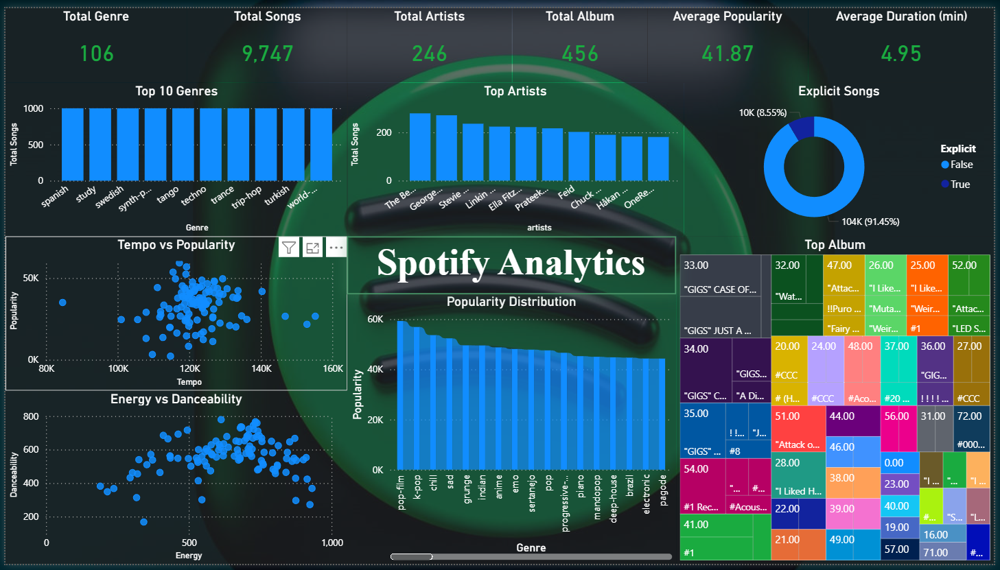

# <center>Spotify Analytics🎵</center>


## 📌 Project Overview

The Spotify Analytics Dashboard is designed to help users explore music trends through interactive charts and KPIs. The dashboard transforms raw Spotify track data into meaningful business insights by analyzing song popularity, artist performance, genre distribution, and audio characteristics.


# Dashboard Preview



---

# Dataset

**Dataset:** Spotify Tracks Dataset

Contains information about thousands of Spotify tracks including:

| Column           | Description                  |
| ---------------- | ---------------------------- |
| Track ID         | Unique Song ID               |
| Track Name       | Song Name                    |
| Artist           | Artist Name                  |
| Album            | Album Name                   |
| Genre            | Song Genre                   |
| Popularity       | Spotify Popularity Score     |
| Duration         | Song Duration                |
| Explicit         | Explicit Content             |
| Danceability     | Danceability Score           |
| Energy           | Energy Level                 |
| Tempo            | BPM                          |
| Valence          | Musical Positivity           |
| Acousticness     | Acoustic Score               |
| Instrumentalness | Instrumental Probability     |
| Loudness         | Loudness (dB)                |
| Speechiness      | Spoken Word Content          |
| Liveness         | Live Performance Probability |

---

# Technologies Used

| Technology   | Purpose                   |
| ------------ | ------------------------- |
| Power BI     | Dashboard Development     |
| SQLite       | Database                  |
| SQL          | Data Analysis             |


---

# Dashboard Components

## KPI Cards

The dashboard provides executive-level KPIs:

* Total Songs
* Total Artists
* Total Albums
* Total Genres
* Average Popularity
* Average Song Duration

---

## Visualizations

### Top 10 Genres

Displays the genres with the highest number of songs.

**Purpose**

* Identify the most represented genres.
* Compare genre popularity.

---

### Top Artists

Ranks artists based on the number of tracks available.

**Purpose**

* Discover the most prolific artists.
* Compare artist contributions.

---

### Explicit Songs

Shows the proportion of explicit and non-explicit songs.

**Purpose**

* Understand explicit content distribution.

---

### Tempo vs Popularity

Scatter plot comparing song tempo and popularity.

**Purpose**

* Analyze whether tempo influences popularity.
* Detect clusters and outliers.

---

### Energy vs Danceability

Scatter plot analyzing relationships between energy and danceability.

**Purpose**

* Discover high-energy dance tracks.
* Identify audio feature trends.

---

### Popularity Distribution

Displays how popularity scores are distributed across songs.

**Purpose**

* Identify the concentration of popular tracks.
* Detect skewness and spread.

---

### Top Albums

Treemap showing album contribution.

**Purpose**

* Compare album sizes.
* Highlight major albums.
---

# How to Run

### Clone Repository

```bash
git clone https://github.com/ASWINa1636/Spotify-Analytics.git
```

### Open

```
Spotify Analytics Dashboard.pbix
```
using Power BI Desktop.

---
### 🎵 Spotify Analytics – Project Story

* Music streaming platforms generate enormous amounts of data every day, making it difficult to quickly understand listener preferences, artist performance, and genre trends. The objective of this project was to transform raw Spotify track data into an interactive Business Intelligence dashboard that helps users explore music trends and discover actionable insights.

* The project began by cleaning and preparing the Spotify dataset, which contains information on 9,747 songs, 246 artists, 456 albums, and 106 music genres. The cleaned data was stored in a SQLite database and analyzed using SQL to calculate key performance indicators and aggregate metrics. These insights were then visualized in Power BI through an interactive dashboard.

* The dashboard provides an executive overview using KPI cards, followed by visualizations that reveal different aspects of the music library. Genre and artist charts identify the most represented categories in the dataset, while the explicit content analysis highlights the proportion of songs containing explicit lyrics. Scatter plots such as Tempo vs Popularity and Energy vs Danceability help uncover relationships between audio characteristics and listener preferences. The popularity distribution chart illustrates how songs are spread across different popularity levels, and the album treemap highlights albums with the largest contribution to the dataset.

* By combining SQL, data visualization, and business intelligence techniques, this dashboard enables users to answer questions such as:

> Which genres dominate the music collection?
> Who are the most represented artists?
> What proportion of songs contain explicit content?
> Is there a relationship between musical characteristics and popularity?
> Which albums contribute the most tracks?

* This project demonstrates practical skills in SQL, SQLite, Power BI, data cleaning, KPI development, dashboard design, and data storytelling. It highlights the ability to transform raw data into meaningful business insights through interactive visualizations, making it suitable for portfolio presentation and real-world business intelligence scenarios. 
---
# License

This project is licensed under the **MIT License**.
